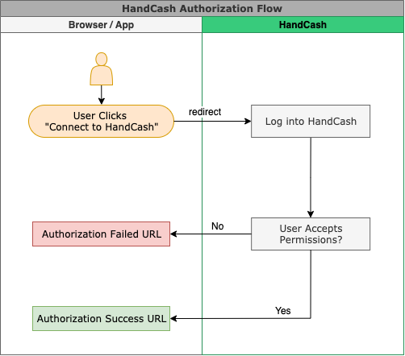

# User Authorization

## Overview

Connect apps need the user to authorize access to their profile and wallet. After authorization, the user is redirected back to your app with an **authToken** (private key) that you use for all subsequent API calls. Users can revoke this at any time.

Flow:

1. User clicks "Connect to HandCash" and is sent to the HandCash login/authorization page.
2. User logs in if needed and sees the permissions your app is requesting.
3. User accepts or declines.
4. HandCash redirects back to your **Authorization Success URL** or **Authorization Failed URL** (configured in your [App Profile](https://dashboard.handcash.io)).



## Permissions

Configure the permissions your app needs in the HandCash Developer Dashboard. Available permissions:

| Name           | Description                                                             |
| -------------- | ----------------------------------------------------------------------- |
| Balance        | Read the user's wallet balance.                                          |
| Payment        | Make payments on the user's behalf.                                     |
| Signing        | Sign data with the user's identity.                                     |
| PublicProfile  | Read `handle`, `displayName`, `avatarUrl`.                               |
| PrivateProfile | Read profile details such as `email`.                                   |

PublicProfile is granted by default.

## Your app authorization

Generate the URL to send the user to HandCash to authorize your app:

```javascript
import { getInstance } from '@handcash/sdk';

const sdk = getInstance({
  appId: process.env.HANDCASH_APP_ID,
  appSecret: process.env.HANDCASH_APP_SECRET,
  baseUrl: 'https://cloud.handcash.io',
});

const redirectionUrl = sdk.getRedirectionUrl();
// Optional: sdk.getRedirectionUrl({ state: 'your-csrf-state' });

// Redirect the user to redirectionUrl (browser or native app).
```

After authorization, HandCash redirects to your **Authorization Success URL** with the `authToken` (e.g. in the query string). Store it securely and use it with `sdk.getAccountClient(authToken)` for that user.
