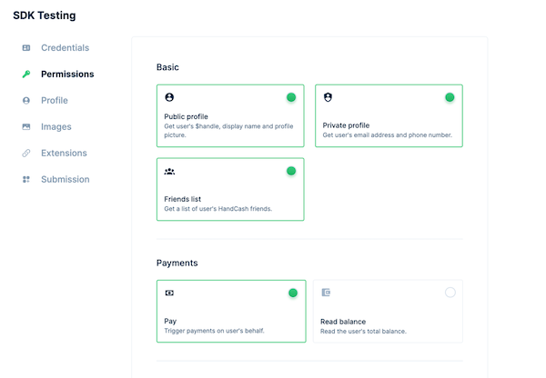
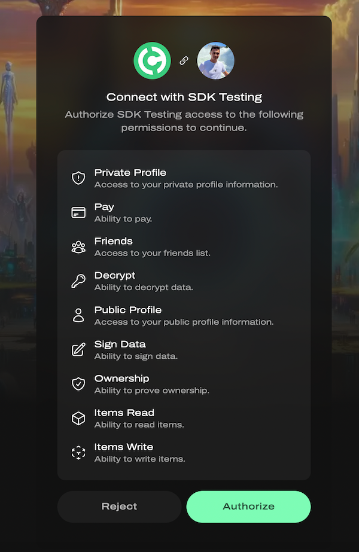
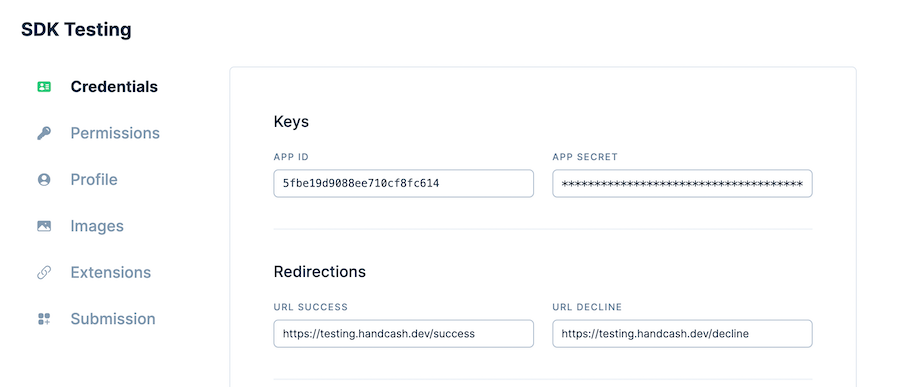

The HandCash SDK is a server-side Node.js library designed to securely interact with HandCash accounts, enabling features like payments, user profiles, and transaction history.

For full API reference and detailed usage examples, visit: https://cloud.handcash.io/sdk-docs/

## Requirements

- Node `v16.X` or higher
- Only for NodeJS, i.e. it doesn't work on the browser side as it's a server-side library for security reasons.

## Documentation

- [Getting started](#getting-started)
- [HandCash Connect](#handcash-connect)
    - [Understanding permissions](#understanding-permissions)
    - [Accessing Existing User Accounts](#accessing-existing-user-accounts)
    - [Get user profile](#get-user-profile)
    - [Get spendable balance](#get-spendable-balances)
    - [Get exchange rate](#get-exchange-rate)
    - [Transfer money](#transfer-money)

## Getting started

### Developer dashboard

To use this SDK, you’ll need an `appId` to identify your application and an `appSecret` to ensure all SDK operations are securely executed under your control.
> Don't have an app yet? Visit [dashboard.handcash.io](https://dashboard.handcash.io) and create your first app.
>

### Installation

`npm i @handcash-sdk`

## HandCash SDK

To get started, create an instance of HandCashSDK. This instance serves as the main entry point for interacting with the SDK and accessing its features.

```typescript
import { getInstance, Connect } from '@handcash-sdk';

const sdk = getInstance({
  appId: '<APP-ID>',
  appSecret: '<APP-SECRET>',
});
```

### Understanding permissions

The `authToken` represents the set of permissions granted to your app, allowing it to access user data such as profile information, balance, transactions, and more.

You can configure the specific permissions your app needs directly from the HandCash Developer Dashboard.



### Accessing Existing User Accounts

To access user accounts, you need to obtain an `authToken`, which is granted when a user authorizes your app.

1. Generate the redirectionUrl that you shall use in your app to send the user to HandCash for authorization:

```typescript
const redirectionUrl = sdk.getRedirectionUrl();
```

2. Redirect the user to this URL from your application.
3. The user will be prompted to authorize your app to access their HandCash account:



4. After authorization, the user will be redirected back to your app along with the `authToken`.

```typescript
const client = sdk.getAccountClient(authToken);
```

You can specify the redirect URL, where users are sent after authorizing your app, directly in the HandCash Developer Dashboard.
This URL is where you’ll receive the authToken and continue the authentication flow.



### Get user profile

The code below demonstrates how to retrieve a user’s profile.

```typescript
import { Connect } from '@handcash-sdk';

const result = await Connect.getCurrentUserProfile({ client });
```

### Get spendable balances

Users can set daily spending limits for apps in their preferences.

```typescript
import { Connect } from '@handcash-sdk';

const result = await Connect.getSpendableBalances({ client });
```

### Get exchange rate

You may want to retrieve exchange rates for a specific currency, and optionally lock a payment to that rate for a limited time after fetching it.

In this example, we fetch the exchange rate for USD. As you’ll notice, the client used here is a static client—not linked to any specific user.
This is possible because certain generic endpoints, like this one, don’t require user authentication, allowing the use of a static client.

```typescript
import { Connect } from '@handcash-sdk';

const result = await Connect.getExchangeRate({ client: sdk.client, path: { currencyCode: 'USD' } });
```

### Transfer money

The code below demonstrates how to initiate a simple payment from the user’s wallet to another user.

In this example, the payment transfers an amount equivalent to 0.01 USD (denominated in BSV) to the user with the handle `nosetwo`.

```typescript
import { Connect } from '@handcash-sdk';

const result = await Connect.pay({
  client,
  body: {
    instrumentCurrencyCode: 'BSV',
    denominationCurrencyCode: 'USD',
    receivers: [{
      sendAmount: 0.01,
      destination: 'nosetwo'
    }]
  }
});
```
